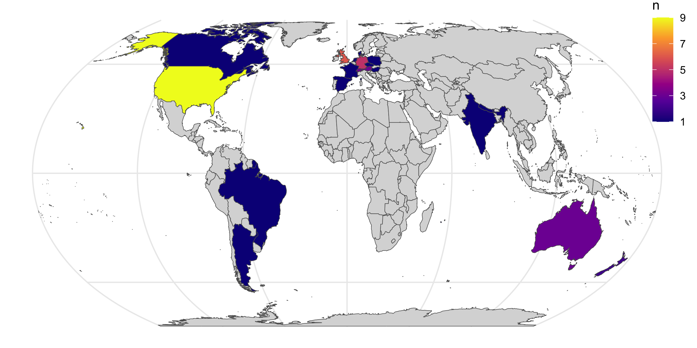

R Dev Day @ PLUS 2024
================

## Participants

There were 44 participants at the Dev Day.

Although we did not have funding available for travel, there were a few
participants from outside the Global North and good spread of countries
within the Global North.

The balance of skills (as judged by the selection committee) was similar
to that at R Project Sprint 2023:

Of the 28 participants that came by application, 16 identified as being
from one or more underrepesented groups in the R developer community.

## Issues

22 issues were worked on during the sprint. A few issues/bug reports
were closed already by the end of the day, there were several more
patches that were accepted over the following week.

Status of issues at the end of the sprint and two months after

