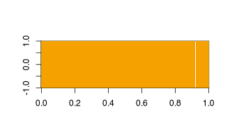

# R Dev Day @ SIP 2024

This year Shiny in Production hosted an "R Dev Day" split over the two days before the pre-conference workshops. R Dev Days are a new initiative of the [R Contribution Working Group](https://contributor.r-project.org/working-group), providing an opportunity for R developers to get involved in contributing to the R Project. R Dev Day will be back at SIP 2025, so read on to find out what participants got up to and consider coming along next year!

## Translation 

An R user's local environment, or *locale* sets their preferred human language. If translations are available, R will display messages, errors and warnings in that language. So one important way that the community contributes to R is to develop and maintain these translations. 

At the R Dev Day, Gabriela de Lima Marin learnt how to contribute translations via [R's Weblate](https://translate.rx.studio/), which provides a user-friendly browser interface for translation. In the first session, she worked in the conventional way, translating one string at a time. In the second session, she explored translating messages in bulk using machine translation. The second method was a little faster, but the automatic translations required careful review - sometimes they had the meaning completely wrong! 

Overall, Gabriela translated over 200 messages at the R Dev Day! If you want to start contributing translations, you can find links to resources on [issue 2](https://github.com/r-devel/r-dev-day/issues/2) of the r-dev-day repository.

## Translation dashboard

The [R Contributor site](https://contributor.r-project.org/) hosts a [translations dashboard](https://contributor.r-project.org/translations-dashboard/) to show the status of translations in the development version of R (*R-devel*) and on Weblate. Contributors can update translations on Weblate at any time, then these translations are collated around once a quarter to update R-devel, which will become the next major/minor release of R that is usually released in April. Mario Reiman, Md Mursalin Hossain Rabbi and Murad Khalilov reviewed the open issues on the [translation dashboard GitHub repository](https://github.com/r-devel/translations-dashboard/issues) and picked two to work on - [#9](https://github.com/r-devel/translations-dashboard/issues/9): avoid using {stringr}, to reduce the number of dependencies required by the R scripts that are run using GitHub actions to update the data sources, and [#38](https://github.com/r-devel/translations-dashboard/issues/38): switch from using the {flexdashboard} package to using Quarto to create the dashboard. Good progress was made on both fronts during the R Dev Day and work will continue to integrate these updates.

When Mario cloned the translations dashboard repository on Windows, he faced difficulties due to version-controlled files containing `?` and `&` characters. Investigating further, we discovered these were supplementary files from the R Markdown rendering, that weren't needed any more. This lead to Heather Turner and Cam Race reviewing the GitHub actions that rendered the dashboard and adapting them to remove old files from the repository before rebuilding. They did a wider review of the GitHub actions and found several had stopped working, meaning the dashboards were not fully updating daily, when scheduled. Heather continued work on this on the train home from SIP 2024 and got them all working again by the end of the journey!

## Bug in Cairo graphics with R

Bugs in base R are tracked on [R's Bugzilla](https://bugs.r-project.org/). There are many ways that contributors can help with reported bugs: reviewing the reports to assess if the issue is a valid bug that has not yet been fixed in R-devel; creating a simple reproducible example (or *reprex*); debugging the R or underlying C code to analyse the root cause of the bug; discussing how to fix the bug, or proposing an update to the source code to fix a bug. For R Dev Days, a number of bug reports are selected where there is a clear next step for contributors to make.

At R Dev Day @ SIP 2024, Ella Kaye and George Stagg looked at [Bug 16721](https://bugs.r-project.org/show_bug.cgi?id=16721), which is an issue affecting Cairo graphics in R (< 4.5.0). In an image plot that is expected to be a full block of colour, a white stripe would appear, as in the example below:

```r
png("ImageWithWhiteStripe.png", width = 330, height = 200, type = "cairo")
image(matrix(1, nrow = 300, ncol = 1))
dev.off()
```



The Cairo device is implemented in the {grDevices} package, which is part of base R. Ella and George built R from source so they were able to debug both the R and C code that gets called in the reprex above. They had to troubleshoot some issues that cropped up when building R on Ella's computer, including complications working with multiple versions of R. Sorting these issues took most of the first session, but Ella appreciated the opportunity to learn some best practices from George, as the more experienced developer. In the second session they were able to focus on the debugging. Following advice that had been given by R Core member Paul Murrell in advance of the R Dev Day, they tried *print debugging*, i.e. adding a print statement to the source code to print out key information, while plotting a thin rectangle with `grid::grid.rect()`. The hypothesis was that nothing would be drawn when the width was less than a pixel. They managed to create an example that plotted nothing in a Cairo graphics device, yet plotted a thin black rectangle in a Quartz device. They looked more closely at C code for the Quartz device and discovered it had a specific workaround with the comment:

> in the case of borderless rectangles snap them to pixels.  
> this solves issues with image() without introducing other artifacts.

So they worked on updating the C code for the Cairo device, to use the same workaround as the Quartz device. Rebuilding R with this change fixed the issue in both the original reprex and their simpler `grid.rect()` example!

In a plot twist, they discovered the Xlib device had different behaviour again, showing no issue with original reprex, but failing on the `grid.rect()` example. Digging into the code again, they found that Quartz *rounded* values to whole pixels, while Xlib *truncated* values. They shared their findings on Bugzilla at the end of the R Dev Day and have since had some feedback from Paul Murrell on the next steps to get a fix accepted into base R.

## R Dev Container

As noted above, building R on your own computer can be a big timesink for contributors. An alternative (currently only recommended for contributions that don't involve C code) is to use the [R Dev Container](https://github.com/r-devel/r-dev-env): a development environment for R that can be launched in the browser using GitHub Codespaces or Gitpod. This has the pre-requisites for building R already installed and is isolated from the user's computer, avoiding many of the issues of building R on your own machine. It comes with documentation and a few helpers, so you can launch the container, get a copy of the source code for R and build R in around half an hour.

Although it was designed to be used in the browser, some contributors to prefer to use the container on their own machine, to avoid using up their internet data or their free time/space allowance on GitHub Codespaces or Gitpod. Unfortunately, the Dev Container is currently built with a specific operating system and for a specific architecture, so it does not work well across platforms.

At the R Dev Day, Seb Mellor looked into building the Docker container for arm64 architecture, so that it would work better on recent macOS computers. The steps for building a Docker container are specified in a Dockerfile. Previous work by others had found the existing Dockerfile would work on arm64 up until the step where it tried to install the `r-base-dev` package from the Ubuntu repository. Seb tested the container at this point and confirmed you could still build R in the container, but it was missing the pre-installed version of R that is usually there. If we could build the container on an arm64 machine, then we could build the `r-base-dev` package as part of the Docker build, but Seb noted arm64 machines are not available on GitHub actions for non-Enterprise customers. So he investigated some alternatives with the conclusion that an arm64 dev container may be cross compiled with additional research, or emulated with a very long build time.

When Seb reported back he said he found it odd that there wasn't an amd64 build of the `r-base-dev` package, so Heather did some further investigation and found that we could get it from a Personal Package Archive (PPA) maintained by Michael Rutter, who compiles the packages for the official Ubuntu repository. This should solve a large part of the problem, so we have a strong lead going forward - this work is being tracked on issue [#112](https://github.com/r-devel/r-dev-day/issues/2) of the r-dev-env GitHub repository.

## R Dev Guide

Even from this handful of tasks that were selected for R Dev Day @ SIP 2024, you can see there is much to learn about contributing to R. One of the first initiatives of the R Contribution Working Group was to create an [R Development Guide](https://contributor.r-project.org/rdevguide/) (or "R Dev Guide" for short), to document some of the processes. Like the translations dashboard and the R Dev Container, this is a resource maintained by the contributor community.

At the R Dev Day, Cam Race worked on two issues related to the R Dev Guide. In both cases, some initial work had been done by others at a previous R Dev Day, so his task was to review their contribution and continue where they left off. The first issue was to add a new section on websites relevant to R contributors, particular those under the r-project.org domain. The second issue was to improve the documentation on how to contribute to R's documentation, including adding some examples of successfully closed bugs. Cam opened two pull requests to propose his changes ([#186](https://github.com/r-devel/rdevguide/pull/186) and [#188](https://github.com/r-devel/rdevguide/pull/188) respectively), along with another pull request to fix minor issues such as broken links.

## Getting involved

As this post shows, there is a large range of activities to get involved in at an R Dev Day, suiting different levels of skills and experience. **R Dev Day @ SIP 2025** will take place on the afternoon of Tuesday 8 October and the morning of Wednesday 9 October. We'd love for next year's R Dev Day to be bigger and better - if you're inspired to come along, the [registration form](https://pretix.eu/r-contributors/r-dev-day-sip-2025/) is open already! 

Meanwhile, for news of other R contributor events and links to resources to help you get started with contributing to base R at any time, head to the R Contributor Site: [contributor.r-project.org](https://contributor.r-project.org/).

